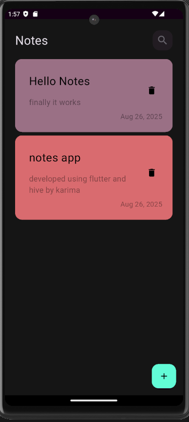

# Notes App (Flutter, Hive, Cubit)
A cross-platform note-taking application with add, edit, and color-coded notes.

## Features
- Add, edit, delete notes
- Color-coded notes
- Persistent storage with Hive
- State management with Cubit

## Tech Stack
- Flutter
- Hive
- Cubit

## Screenshots
- 
- 
- 
- 
- 
